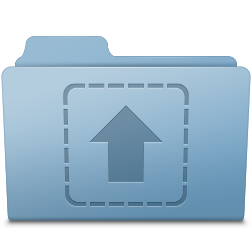

<p align="center">
  <a href="" rel="noopener">
 </a>
</p>

<h2 align="center">A fronted for an image upload system</h2>

<div align="center">

[]()

</div>

---

## 📝 Table of Contents

-   [About](#about)
-   [Structures](#structures)
-   [Getting Started](#getting_started)
-   [Built Using](#built_using)
-   [Authors](#authors)

## 🧐 About <a name = "about"></a>

This project it's about developing skills in MongoDB and NodeJS, creating a image upload system in the frontend using ReactJS as a framework.

## 📁 Structures <a name="structures"></a>

### This is how the Project is structured.

```
app/
├─ node_modules/
├─ public/
├─ src/
│  └─ components/
│     └─ FileList/
│        └─ index.js
│        └─ styles.js
│     └─ Upload/
│        └─ index.js
│        └─ styles.js
│  └─ services/
│     └─ api.js
│  └─ styles/
│     └─ global.js
│  └─ App.js
│  └─ index.js
│  └─ styles.js
├─ .gitignore
├─ .prettierrc
├─ package.json
├─ README.md
└─ yarn.lock
```

## 🏁 Getting Started <a name = "getting_started"></a>

These instructions will get you a copy of the project up and running on your local machine for development and testing purposes.

### Prerequisites & Installing

What packages do you need to install the software.

```
-NodeJS
    "cors": "^2.8.5",
    "dotenv": "^16.0.3",
    "express": "^4.18.2",
    "mongoose": "^6.6.5",
    "morgan": "^1.10.0",
    "multer": "^1.4.5-lts.1"
```

### Runing & Usage

A step by step series of examples that tell you how to get a development env running.

Running the project with the command line

```
node src/index.js
```

There are 3 different requests to test this backend.

#### POST Posts

This is a request to register a user. Expect a form-data with a key file and a image as value in the format below with the URL: http://localhost:3000/posts

```
{
  file: image file
}
```

#### GET List

This is a request that returns all registered projects. Don't need to pass params through a JSON, just run the request with the URL: http://localhost:3000/posts

#### DEL Delete

This is a request that delete an specific project. Don't need to pass params through a JSON, just run the request with the URL passing the project's Id: http://localhost:3000/posts/+imageId

```
http://localhost:3000/posts/633216f1c7c06fdbfe9dd64c
```

## ⛏️ Built Using <a name = "built_using"></a>

-   [MongoDB](https://www.mongodb.com/) - MongoDB
-   [NodeJS](https://nodejs.org/en/) - NodeJS
-   [ExpressJS](https://expressjs.com/) - ExpressJS

## ✍️ Authors <a name = "authors"></a>

-   [@joaorjoaquim](https://github.com/joaorjoaquim) - Idea & Initial work
